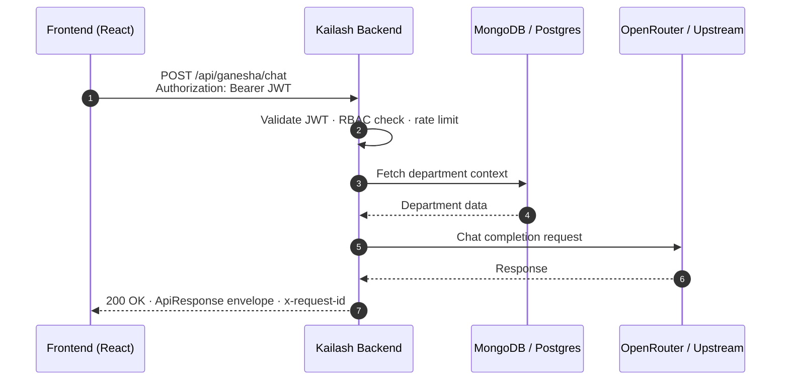

# Architecture

This is the top-level map of the Kailash monorepo. The full design
document — capability matrix, data flows, service contracts, and the
Automobile-LLM moat strategy — lives in
[`docs/architecture/platform-overview.md`](docs/architecture/platform-overview.md).

## System topology

```
Consumer Products (URGAA, GSTSAAS, Ignition, ARJUN, Kailash Dashboard)
                         │
                         ▼
              Kailash Backend (FastAPI)
              ┌──────────────────────────────────────┐
              │  Main App                            │
              │  24 AI Departments · Auth · RBAC     │
              │  GANESHA Orchestrator                │
              │  SHIV Security · PARVATI Workload    │
              ├──────────────────────────────────────┤
              │  Platform Services (internal modules) │
              │  document-ai · forecasting · anomaly │
              │  rag · vision-gateway · speech       │
              │  model-registry · knowledge-graph    │
              │  automobile-llm                      │
              ├──────────────────────────────────────┤
              │  Shared Library                      │
              │  schemas · auth · errors · logging   │
              │  build_app() factory                 │
              └──────────────────────────────────────┘
                         │
              ┌──────────┴──────────┐
              ▼                     ▼
    MongoDB · PostgreSQL         Kailash Frontend
    Redis                       (React 19)
```

## Request lifecycle



## Backend structure

```
backend/
├── app/                    # Main FastAPI application
│   ├── main.py             # App entry point, lifecycle, middleware
│   ├── core/               # Config, database, MongoDB, Firebase, RBAC
│   ├── api/                # 20+ REST API routers
│   ├── models/             # User, Department, Task, Activity models
│   ├── services/           # Email, GANESHA AI, orchestrator, RAG
│   ├── departments/        # 24 deity-themed AI departments
│   ├── guardians/          # GANESHA, SHIV, PARVATI agents
│   ├── middleware/         # Security headers, error handling
│   └── agents/             # Multi-model strategy, prompts
├── services/               # 9 platform AI services (internal modules)
│   ├── document-ai/        # PDF extraction, field validation
│   ├── forecasting/        # EMA + trend + seasonal baseline
│   ├── anomaly/            # IsolationForest anomaly detection
│   ├── rag/                # Embeddings + cosine similarity store
│   ├── vision-gateway/     # Tiered vision model routing
│   ├── speech/             # ASR + TTS with Indic locales
│   ├── model-registry/     # MLflow-shaped model registry
│   ├── knowledge-graph/    # Typed graph with BFS lookup
│   └── automobile-llm/     # Domain-pinned chat (the moat)
├── shared/                 # Shared library
│   ├── app.py              # FastAPI build_app() factory
│   ├── auth.py             # require_internal_token dependency
│   ├── schemas.py          # ApiResponse, HealthResponse envelopes
│   ├── errors.py           # PlatformError hierarchy
│   ├── config.py           # BaseServiceSettings
│   └── logging.py          # Structured JSON logging
├── knowledge/              # Department knowledge base data
├── tests/                  # Backend tests
├── requirements.txt        # Python dependencies
└── server.py               # Uvicorn entry point
```

## Shared library (`backend/shared/`)

Every module uses the same foundation:

- `build_app(settings, routers=...)` — FastAPI factory that wires CORS,
  request-id middleware, `/health`, `/`, `/metrics`, and the typed
  `PlatformError` exception handler.
- `BaseServiceSettings` — pydantic-settings base with `service_name`,
  `version`, `env`, `log_level`, `log_json`, `cors_origins`,
  `platform_internal_token`.
- `require_internal_token` — FastAPI dependency validating
  `X-Platform-Token` against `PLATFORM_INTERNAL_TOKEN`.
- `ApiResponse` / `ErrorDetail` / `HealthResponse` — response envelopes.
- `NotFoundError` / `ValidationError` / `UpstreamError` — typed errors
  that map to stable `code` strings in the response.
- Structured JSON logging with a `service` field injected via
  `logging.Filter`.

## Deployment shape

- **Local** — `docker compose up -d --build`. Single container with
  MongoDB, PostgreSQL, and Redis alongside.
- **CI** — `.github/workflows/ci.yml` runs a 6-job matrix: lint, shared,
  services (9-way), backend, frontend, compose-build.
- **Prod** — Docker Compose on Vultr VPS behind Nginx reverse proxy with
  Let's Encrypt SSL. Health check endpoint monitored.
- **Firebase** — Frontend deployed to Firebase Hosting with CI/CD
  auto-deploy on push to main.
