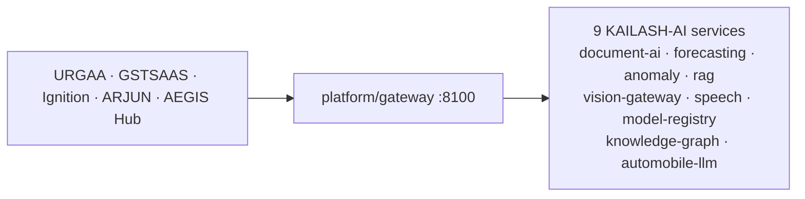

# Architecture

See [`docs/architecture/platform-overview.md`](docs/architecture/platform-overview.md)
for the full KAILASH-AI platform architecture, capability matrix, service
contracts, and the Automobile-LLM moat strategy.

