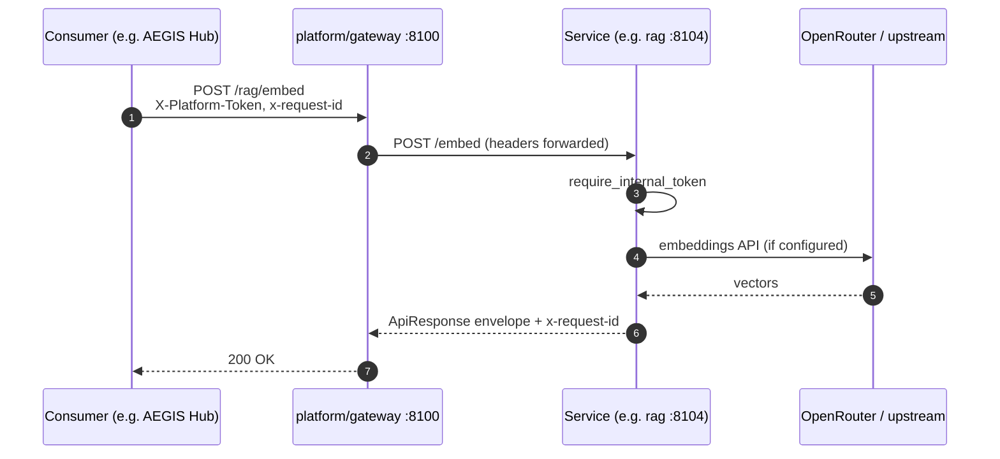

# Architecture

This is the top-level map of the KAILASH-AI monorepo. The full design
document — capability matrix, data flows, service contracts, and the
Automobile-LLM moat strategy — lives in
[`docs/architecture/platform-overview.md`](docs/architecture/platform-overview.md).

## System topology

```mermaid
flowchart LR
  subgraph Consumers["Consumer Products"]
    URGAA[URGAA]
    GST[GSTSAAS]
    IGN[Ignition]
    ARJ[ARJUN]
    AEGIS[AEGIS Hub]
  end

  GW["platform/gateway :8100<br/>X-Platform-Token · x-request-id"]

  subgraph Services["KAILASH-AI Services (FastAPI)"]
    DOC[document-ai :8101]
    FC[forecasting :8102]
    AN[anomaly :8103]
    RAG[rag :8104]
    VG[vision-gateway :8105]
    SP[speech :8106]
    MR[model-registry :8107]
    KG[knowledge-graph :8108]
    LLM[automobile-llm :8109]
  end

  subgraph Shared["platform/kailash_shared"]
    APPF[build_app factory]
    AUTH[require_internal_token]
    SCHEMA[ApiResponse / HealthResponse]
    ERR[PlatformError hierarchy]
    LOG[structured JSON logging]
  end

  Consumers --> GW --> Services
  Services -.uses.-> Shared
```

## Request lifecycle

## Shared library (`platform/kailash_shared`)

Every service is built on the same foundation:

- `build_app(settings, routers=...)` — FastAPI factory that wires CORS,
  request-id middleware, `/health`, `/`, `/metrics`, and the typed
  `PlatformError` exception handler.
- `BaseServiceSettings` — pydantic-settings base with `service_name`,
  `version`, `env`, `log_level`, `log_json`, `cors_origins`,
  `platform_internal_token`.
- `require_internal_token` — FastAPI dependency validating
  `X-Platform-Token` against `PLATFORM_INTERNAL_TOKEN`.
- `ApiResponse` / `ErrorDetail` / `HealthResponse` — response envelopes.
- `NotFoundError` / `ValidationError` / `UpstreamError` — typed errors
  that map to stable `code` strings in the response.
- Structured JSON logging with a `service` field injected via
  `logging.Filter` (idempotent across multiple apps in the same process).

## Deployment shape

- **Local** — `docker compose -f deploy/docker/docker-compose.platform.yml up`.
  Every service's Dockerfile uses the repo root as build context so it can
  `COPY platform /opt/platform && pip install /opt/platform`.
- **CI** — `.github/workflows/ci.yml` runs a 6-job matrix: lint, shared,
  services (9-way), backend, frontend, compose-build.
- **Prod** — the same images behind an internet-facing reverse proxy
  (TLS + WAF) with the gateway as the only public ingress. Inter-service
  traffic stays on a private network; `X-Platform-Token` is a
  defence-in-depth layer.
