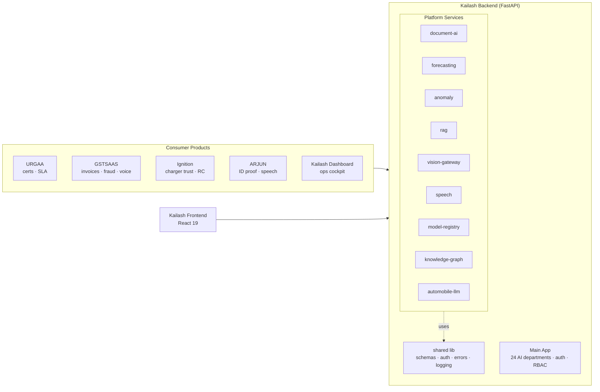

<div align="center">

# Kailash

**The internal ML/AI platform powering India's EV revolution.**

[](https://github.com/flywithvvk/kailash/actions/workflows/ci.yml)
[](https://www.python.org/)
[](https://fastapi.tiangolo.com/)
[](https://react.dev/)
[](LICENSE)
[](https://github.com/astral-sh/ruff)

</div>

---

Kailash is **not** a product sold to customers. It is the shared AI engine
that powers URGAA, GSTSAAS, Ignition, ARJUN, and the Kailash operations
dashboard — all calling into a single unified backend.

## Table of Contents

1. [Architecture](#architecture)
2. [Platform Services](#platform-services)
3. [Repository Layout](#repository-layout)
4. [Quick Start](#quick-start)
5. [Service Contract](#service-contract)
6. [Development Workflow](#development-workflow)
7. [Testing](#testing)
8. [Continuous Integration](#continuous-integration)
9. [Configuration & Secrets](#configuration--secrets)
10. [Roadmap — Automobile-LLM Moat](#roadmap--automobile-llm-moat)
11. [Contributing](#contributing)
12. [License](#license)

---

## Architecture



Full design, capability matrix, and the Automobile-LLM moat strategy:
[`docs/architecture/platform-overview.md`](docs/architecture/platform-overview.md).

## Platform Services

| Service                | Responsibility                              | Key Tech                                              |
| ---------------------- | ------------------------------------------- | ----------------------------------------------------- |
| `document-ai`          | PDF text extraction, field validation       | `pypdf`, validation profiles                          |
| `forecasting`          | Demand / uptime / breakdowns / energy       | EMA + trend + seasonal baseline (numpy)               |
| `anomaly`              | SLA / fraud / trust anomalies               | scikit-learn `IsolationForest`                        |
| `rag`                  | Embeddings + in-memory cosine index         | OpenRouter embeddings + SHA-256 hash fallback         |
| `vision-gateway`       | Routes GPT-4o / Gemini 1.5 / Claude 3.5     | Tier-based router via OpenRouter                      |
| `speech`               | IndicWhisper ASR + TTS                      | Provider-agnostic stubs, Indic locales                |
| `model-registry`       | MLflow-shape registry + evaluations         | SQLite                                                |
| `knowledge-graph`      | Regs · parts · HSN · workflows · certs      | In-memory graph + BFS neighbours                      |
| `automobile-llm`       | Automobile-domain chat (the moat)           | OpenRouter with pinned system prompt                  |

Each service module follows `routes.py` → `service.py` pattern, wired through
`backend/shared/app.py`'s `build_app()` factory. Domain routes are guarded by
`require_internal_token`.

## Repository Layout

```
.
├── backend/
│   ├── app/                    # Main FastAPI application
│   │   ├── core/               # Config, database, security, seeding
│   │   ├── api/                # REST API routers (auth, departments, etc.)
│   │   ├── models/             # Pydantic + MongoDB models
│   │   ├── services/           # Email, GANESHA AI, orchestrator, RAG
│   │   ├── departments/        # 24 AI deity departments
│   │   ├── guardians/          # GANESHA, SHIV, PARVATI agents
│   │   ├── middleware/         # Security, error handling
│   │   └── agents/             # Multi-model strategy, prompts
│   ├── services/               # 9 platform AI services (internal modules)
│   │   ├── document-ai/ ... automobile-llm/
│   ├── shared/                 # Shared library (schemas, auth, errors, logging)
│   ├── knowledge/              # Knowledge base data for departments
│   ├── routers/                # V2 GANESHA router
│   ├── tests/                  # Backend tests
│   ├── requirements.txt
│   └── server.py
├── frontend/                   # React 19 UI
│   ├── src/
│   │   ├── components/         # UI components (Radix UI, Tailwind)
│   │   ├── pages/              # Application pages
│   │   └── services/           # API service layer
│   └── package.json
├── deploy/
│   ├── docker/                 # Docker Compose variants
│   └── vultr/                  # VPS setup & deploy scripts
├── docs/
│   ├── architecture/           # Platform overview, knowledge architecture
│   ├── api/                    # API documentation
│   ├── guides/                 # Integration, deployment guides
│   └── business/               # Branding, requirements, readiness
├── tests/
│   ├── platform/               # Shared library tests
│   ├── backend/                # Backend integration tests
│   └── integration/            # End-to-end tests
├── scripts/                    # MongoDB init, health checks, backups
├── .github/workflows/          # CI/CD (lint, test, deploy)
├── Dockerfile                  # Single-container production build
├── docker-compose.yml          # Local & production stack
├── Makefile                    # Dev convenience targets
└── ruff.toml                   # Python lint/format config
```

## Quick Start

### 1. Full stack via Docker Compose

```bash
docker compose up -d --build

# Health check
curl http://localhost:8000/api/health
```

### 2. Backend locally, without Docker

```bash
pip install -r backend/requirements.txt
uvicorn backend.app.main:app --reload --port 8000
```

### 3. Frontend

```bash
cd frontend
yarn install
yarn start
```

## Service Contract

Every module built with `build_app()` exposes:

| Endpoint   | Method | Description                                                           |
| ---------- | ------ | --------------------------------------------------------------------- |
| `/health`  | GET    | `{ service, version, uptime_s }`                                      |
| `/`        | GET    | Service metadata                                                      |
| `/metrics` | GET    | Prometheus text-format counters + histograms                          |
| `/docs`    | GET    | OpenAPI 3 UI                                                          |
| Domain routes | —   | Return `ApiResponse` envelopes                                        |

### Auth & tracing

- **Internal token** — callers send `X-Platform-Token: <value>`; validated
  via `backend.shared.auth.require_internal_token`. No-op in dev mode.
- **Request ID** — middleware accepts `x-request-id` from the caller or
  generates a hex UUID; echoed on response and added to log records.

### Errors

Typed exceptions (`NotFoundError`, `ValidationError`, `UpstreamError`) map
to a consistent error envelope:

```json
{
  "ok": false,
  "error": { "code": "not_found", "message": "...", "hint": null },
  "request_id": "f30c..."
}
```

## Development Workflow

```bash
make install        # Install backend requirements
make lint           # ruff check backend/
make fmt            # ruff format backend/
make test           # pytest tests/
make test-platform  # pytest each platform service
make up             # docker compose up -d --build
make down           # docker compose down
```

Pre-commit hooks are configured in `.pre-commit-config.yaml`:

```bash
pip install pre-commit && pre-commit install
```

## Testing

| Suite                       | Tests | Status |
| --------------------------- | ----- | ------ |
| `tests/platform/`           | 5     | ✅     |
| Platform services (×9)      | 53    | ✅     |
| `tests/backend/`            | 10+   | ✅     |
| `tests/integration/`        | 3+    | ✅     |

```bash
make test
```

## Continuous Integration

`.github/workflows/ci.yml` runs on every push / PR:

| Job              | Description                                                    |
| ---------------- | -------------------------------------------------------------- |
| `lint`           | `ruff check` across `backend/`                                 |
| `shared`         | Runs `tests/platform/`                                         |
| `services`       | 9-way matrix — each platform service tested                    |
| `backend`        | Smoke tests for the main application                           |
| `frontend`       | `yarn install` + `yarn build`                                  |
| `compose-build`  | `docker compose build` sanity check                            |

## Configuration & Secrets

- Every module ships a `.env.example`. Copy to `.env` and populate locally.
- **No real secrets are ever committed.** `.gitignore` excludes `.env`,
  `.venv/`, build artifacts, and local caches.
- Provider order: `OPENROUTER_API_KEY` → `ANTHROPIC_API_KEY` → keyword fallback.
- See [`SECURITY.md`](SECURITY.md) for the secret-handling playbook.

## Roadmap — Automobile-LLM Moat

The `automobile-llm` service is the commercial moat. Current implementation
is an OpenRouter wrapper with a pinned domain system prompt. Productisation path:

1. **Today** — pure API wrappers over OpenAI / Anthropic / Google.
2. **Next** — fine-tune Llama-3.1-8B on scraped automotive regulations +
   synthetic Q&A derived from service manuals.
3. **Compounding** — continue fine-tuning on anonymised customer data from
   URGAA / GSTSAAS / Ignition / ARJUN.
4. **Product** — Automobile-LLM-13B, licensable to OEMs and DISCOMs.

## Contributing

See [`CONTRIBUTING.md`](CONTRIBUTING.md) for the branching model, commit
conventions, PR checklist, and release process.

## License

Proprietary — see [`LICENSE`](LICENSE).

---

<sub>Made for India's EV revolution · Kailash AI Team · Go4Garage</sub>
