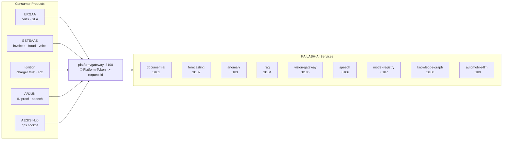

<div align="center">

# KAILASH-AI

**The internal ML/AI platform that powers every sibling product.**

[](https://github.com/flywithvvk/kailash/actions/workflows/ci.yml)
[](https://www.python.org/)
[](https://fastapi.tiangolo.com/)
[](LICENSE)
[](https://github.com/astral-sh/ruff)

</div>

---

KAILASH-AI is **not** a product sold to customers. It is the shared ML/AI
engine room that URGAA, GSTSAAS, Ignition, ARJUN and AEGIS Hub all call
into over HTTP behind a single gateway with an internal service token.

This monorepo ships:

- **9 FastAPI microservices** (ports `8101-8109`) with real implementations
  for OCR, forecasting, anomaly detection, RAG, vision routing, speech,
  model registry, knowledge graph, and the automobile-domain LLM.
- **`platform/gateway`** — single entry point (`:8100`) that reverse-proxies
  all 9 services and forwards auth / tracing headers.
- **`platform/kailash_shared`** — pip-installable Python package that every
  service depends on for settings, logging, schemas, auth, errors, and the
  FastAPI app factory (CORS, request-id, `/health`, `/metrics`, typed error
  mapping).
- **`apps/`** — the AEGIS Hub consumer (FastAPI backend + React frontend).
- **End-to-end CI matrix**, `docker-compose` for local stack, Makefile,
  `ruff`, pre-commit, and a full test suite (**53 service tests + 5
  shared-lib tests**, all green).

## Table of Contents

1. [Architecture](#architecture)
2. [Service Catalog](#service-catalog)
3. [Repository Layout](#repository-layout)
4. [Quick Start](#quick-start)
5. [Service Contract](#service-contract)
6. [Development Workflow](#development-workflow)
7. [Testing](#testing)
8. [Continuous Integration](#continuous-integration)
9. [Configuration & Secrets](#configuration--secrets)
10. [Roadmap — Automobile-LLM Moat](#roadmap--automobile-llm-moat)
11. [Contributing](#contributing)
12. [License](#license)

---

## Architecture



Full design, capability matrix, and the Automobile-LLM moat strategy:
[`docs/architecture/platform-overview.md`](docs/architecture/platform-overview.md).

## Service Catalog

| Service                    | Port  | Responsibility                              | Key Tech                                              |
| -------------------------- | ----- | ------------------------------------------- | ----------------------------------------------------- |
| `platform/gateway`         | 8100  | Reverse proxy, auth forwarding, tracing     | FastAPI + `httpx`                                     |
| `services/document-ai`     | 8101  | PDF text extraction, field validation       | `pypdf`, validation profiles                          |
| `services/forecasting`     | 8102  | Demand / uptime / breakdowns / energy       | EMA + trend + seasonal baseline (numpy)               |
| `services/anomaly`         | 8103  | SLA / fraud / trust anomalies               | scikit-learn `IsolationForest`                        |
| `services/rag`             | 8104  | Embeddings + in-memory cosine index         | OpenRouter embeddings + SHA-256 hash fallback         |
| `services/vision-gateway`  | 8105  | Routes GPT-4o / Gemini 1.5 / Claude 3.5     | Tier-based router (fast / balanced / long) via OpenRouter |
| `services/speech`          | 8106  | IndicWhisper ASR + TTS                      | Provider-agnostic stubs, Indic locales                |
| `services/model-registry`  | 8107  | MLflow-shape registry + evaluations         | SQLite                                                |
| `services/knowledge-graph` | 8108  | Regs · parts · HSN · workflows · certs      | In-memory graph + BFS neighbours                      |
| `services/automobile-llm`  | 8109  | Automobile-domain chat (the moat)           | OpenRouter with pinned system prompt                  |

Each service is a self-contained FastAPI app: `app/main.py` wires
`build_app()` from `kailash_shared`, `app/routes.py` declares HTTP
endpoints guarded by `require_internal_token`, and `app/service.py` holds
the business logic.

## Repository Layout

```
.
├── apps/
│   ├── backend/              # AEGIS Hub FastAPI consumer
│   └── frontend/             # AEGIS Hub React UI
├── platform/
│   ├── kailash_shared/       # pip-installable shared lib (schemas, auth, app factory)
│   ├── gateway/              # :8100 reverse proxy
│   └── pyproject.toml        # installs kailash_shared into every service image
├── services/                 # 9 FastAPI services, all Dockerized
│   ├── document-ai/ ...      # :8101
│   └── automobile-llm/       # :8109
├── deploy/
│   └── docker/
│       └── docker-compose.platform.yml   # full stack, build context = repo root
├── docs/
│   ├── architecture/         # platform-overview, knowledge-arch, audits
│   ├── api/  deployment/  guides/  business/
├── scripts/
│   └── generate_services.ps1 # scaffolder used to regenerate all 9 services
├── tests/
│   ├── platform/             # shared-lib tests
│   ├── backend/  integration/  scripts/
├── .github/workflows/ci.yml  # 6-job matrix (lint / shared / services / backend / frontend / compose-build)
├── Makefile · ruff.toml · .pre-commit-config.yaml
├── ARCHITECTURE.md · CONTRIBUTING.md · SECURITY.md · CHANGELOG.md · LICENSE
```

## Quick Start

### 1. Full platform via Docker Compose

```bash
cd deploy/docker
docker compose -f docker-compose.platform.yml up -d --build

# Health check through the gateway
curl http://localhost:8100/health
curl http://localhost:8100/document-ai/health
curl http://localhost:8100/forecasting/health
```

### 2. A single service, locally

```bash
# Install the shared lib once
pip install -e platform

# Pick a service and run it
cd services/document-ai
pip install -r requirements.txt
uvicorn app.main:app --reload --port 8101
```

### 3. The AEGIS Hub consumer

```bash
cd apps/backend
cp .env.example .env          # fill in OpenRouter / Mongo / internal token
pip install -r requirements.txt
uvicorn app.main:app --reload
```

## Service Contract

Every KAILASH-AI service exposes a uniform surface courtesy of the shared
`build_app()` factory:

| Endpoint   | Method | Description                                                           |
| ---------- | ------ | --------------------------------------------------------------------- |
| `/health`  | GET    | `{ service, version, uptime_s }`                                      |
| `/`        | GET    | Service metadata                                                      |
| `/metrics` | GET    | Prometheus text-format counters + histograms                          |
| `/docs`    | GET    | OpenAPI 3 UI                                                          |
| Domain routes | —   | Return `kailash_shared.schemas.ApiResponse` envelopes                 |

### Auth & tracing

- **Internal token** — callers send `X-Platform-Token: <value>`; the gateway
  forwards it verbatim and services validate via
  `kailash_shared.auth.require_internal_token`. If `PLATFORM_INTERNAL_TOKEN`
  is not configured, the dependency is a no-op (dev mode).
- **Request ID** — the middleware accepts `x-request-id` from the caller or
  generates a hex UUID; it is echoed on the response and added to log
  records under `request_id`.

### Errors

Typed exceptions from `kailash_shared.errors` (`NotFoundError`,
`ValidationError`, `UpstreamError`, …) map to a consistent error envelope:

```json
{
  "ok": false,
  "error": { "code": "not_found", "message": "...", "hint": null },
  "request_id": "f30c…"
}
```

## Development Workflow

Top-level `Makefile` exposes the common loops:

```bash
make venv           # create .venv and install platform + all services in editable mode
make lint           # ruff over platform/ services/
make format         # ruff format
make test           # pytest (platform + all services)
make compose-up     # docker compose -f deploy/docker/docker-compose.platform.yml up -d --build
make compose-down
```

Pre-commit hooks (`ruff`, `ruff-format`, `end-of-file-fixer`, `trailing-whitespace`)
are wired in `.pre-commit-config.yaml`. Install with:

```bash
pip install pre-commit && pre-commit install
```

## Testing

- **Shared library** — `tests/platform/test_shared.py` covers `/health`,
  `/`, `/metrics`, request-id propagation, typed error mapping, and the
  internal-token guard.
- **Per-service** — every service has `tests/test_health.py` and
  `tests/test_routes.py` that exercise the real route wiring against a
  `TestClient`.
- **Backend & frontend** — AEGIS Hub consumer tests live under
  `tests/backend` and `apps/frontend/` respectively.

Run the whole test suite:

```bash
make test
# or
.venv\Scripts\python.exe -m pytest -q
```

Current status:

| Suite                    | Tests | Status |
| ------------------------ | ----- | ------ |
| `tests/platform/`        | 5     | ✅     |
| Service route tests (×9) | 53    | ✅     |

## Continuous Integration

`.github/workflows/ci.yml` runs on every push / PR:

| Job              | What it does                                                                    |
| ---------------- | ------------------------------------------------------------------------------- |
| `lint`           | `ruff check` + `ruff format --check` across `platform/` and `services/`         |
| `shared`         | Installs `platform/` and runs `tests/platform/`                                 |
| `services`       | 9-way matrix — installs each service and runs its `tests/`                      |
| `backend`        | Installs `apps/backend`, runs `tests/backend/`                                  |
| `frontend`       | `yarn install` + `yarn test --watchAll=false` for `apps/frontend/`              |
| `compose-build`  | `docker compose -f deploy/docker/docker-compose.platform.yml build`             |

## Configuration & Secrets

- Every service ships a `.env.example`. Copy to `.env` and populate locally.
- **No real secrets are ever committed.** `.gitignore` excludes `.env`,
  `.venv/`, build artifacts, and local caches. GitHub push protection is
  enabled upstream.
- The backend provider order is:
  1. `OPENROUTER_API_KEY` → OpenAI-compatible `/chat/completions`
  2. `ANTHROPIC_API_KEY`  → Claude direct
  3. Keyword fallback (no network calls)
- If a secret is ever committed: **rotate at the provider first**, then
  scrub history. See [`SECURITY.md`](SECURITY.md) for the response playbook.

## Roadmap — Automobile-LLM Moat

The `services/automobile-llm` service is the commercial moat. The current
implementation is a thin OpenRouter wrapper with a pinned domain system
prompt. The productisation path is:

1. **Today** — pure API wrappers over OpenAI / Anthropic / Google. Ship
   fast, pay rent.
2. **Next** — fine-tune Llama-3.1-8B on scraped automotive regulations +
   synthetic Q&A derived from service manuals.
3. **Compounding** — continue fine-tuning on anonymised customer data from
   URGAA / GSTSAAS / Ignition / ARJUN. Now there is a model no competitor
   can replicate.
4. **Product** — Automobile-LLM-13B, licensable to OEMs and DISCOMs.

See [`docs/architecture/platform-overview.md`](docs/architecture/platform-overview.md)
for the detailed strategy.

## Contributing

See [`CONTRIBUTING.md`](CONTRIBUTING.md) for the branching model, commit
conventions, PR checklist, and release process. Security issues should be
reported privately per [`SECURITY.md`](SECURITY.md).

## License

Proprietary — see [`LICENSE`](LICENSE).

---

<sub>Made for India's EV revolution · KAILASH AI Team · Go4Garage</sub>
