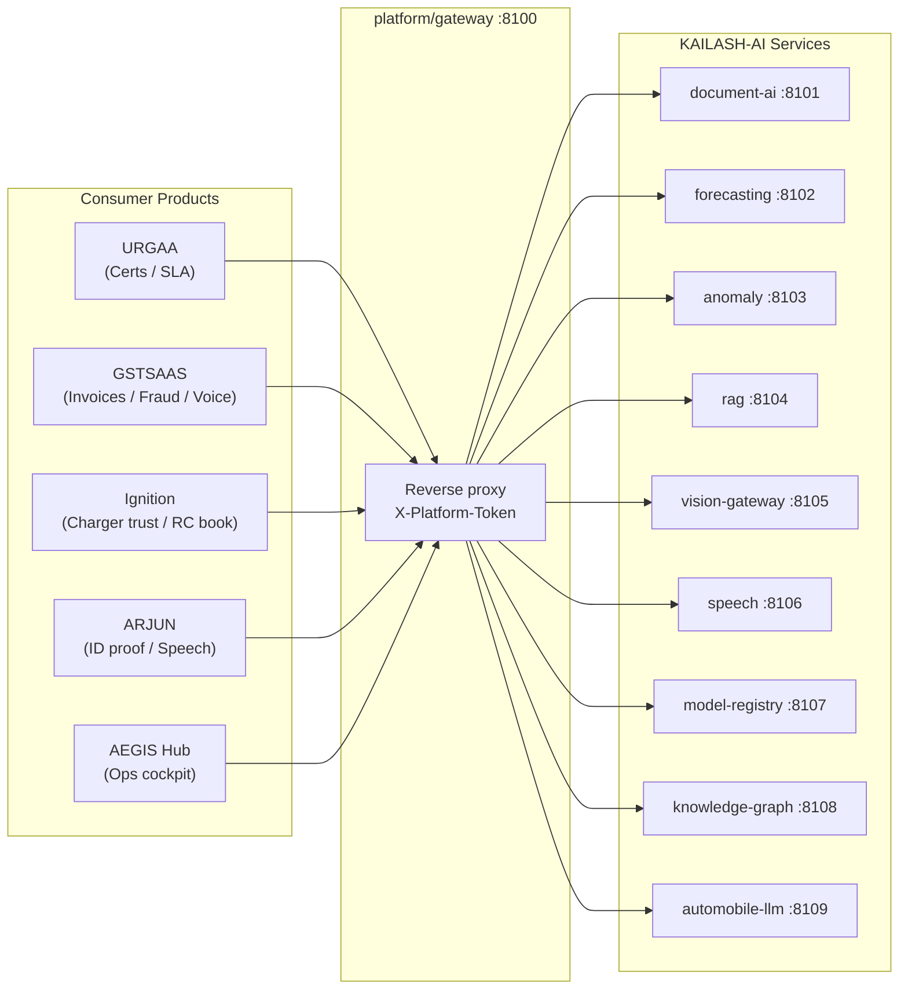

# KAILASH-AI — Platform Architecture

> The shared ML/AI platform that serves all sibling products.
> Not a product sold to end customers — treat as internal infrastructure.

## 1. Platform Positioning

KAILASH-AI is the **engine room**. Every consumer product (URGAA, GSTSAAS,
Ignition, ARJUN, AEGIS Hub) calls into KAILASH-AI for document
understanding, forecasting, anomaly detection, retrieval, vision, speech,
model governance, graph reasoning, and the automobile-domain LLM.



## 2. Capability Matrix

| Capability | Service | Consumers | Tech |
|---|---|---|---|
| Document AI (OCR, layout, extraction, validation) | `services/document-ai` | URGAA (certs), GSTSAAS (invoices), Ignition (RC book), ARJUN (ID) | Azure Document Intelligence → in-house LayoutLMv3 at scale |
| Forecasting (demand, uptime, breakdowns, energy) | `services/forecasting` | All | Prophet / NeuralProphet + XGBoost |
| Anomaly Detection | `services/anomaly` | URGAA (SLA), GSTSAAS (fraud), Ignition (charger trust) | Isolation Forest + autoencoders |
| Embedding & RAG (shared vector store, index pipelines) | `services/rag` | All | pgvector → Pinecone / Qdrant at scale |
| Vision LLM Gateway (photos, certs, practicals) | `services/vision-gateway` | All | Route GPT-4o / Gemini 1.5 / Claude 3.5 by cost & latency |
| Speech (IndicWhisper ASR + TTS) | `services/speech` | Ignition, GSTSAAS voice, ARJUN | AI4Bharat + ElevenLabs + Coqui |
| Model Registry & Evals | `services/model-registry` | Internal | MLflow + LangSmith + Braintrust |
| Knowledge Graph (regs, parts, HSN, workflows, certs) | `services/knowledge-graph` | URGAA, GSTSAAS, ARJUN | Neo4j + Cypher over embeddings |
| Automobile LLM (the moat) | `services/automobile-llm` | All + OEM / DISCOM licensees | Llama-3.1-8B fine-tune → 13B licensed product |

## 3. AI Moat — the Automobile LLM

The ladder of defensibility:

1. **API wrappers** over OpenAI / Anthropic / Google — ship fast, pay rent.
2. **Fine-tune Llama-3.1-8B** on scraped regulations + synthetic data.
3. **Continue fine-tuning on real customer data** (properly anonymized).
   Now no competitor can build this.
4. **Automobile-LLM-13B** — the licensed-in-itself product; sold to OEMs
   and DISCOMs.

`services/automobile-llm` is the home of this ladder. Levels 1–2 first,
then gate real-customer data fine-tuning behind the model-registry and
eval harness.

## 4. Service Contract

All services expose:

- `GET /health` → `{ "service": "<name>", "status": "ok", "version": "..." }`
- `GET /` → service metadata
- Domain endpoints under `/<verb>` returning `platform.shared.schemas.ApiResponse`

Internal auth: every request carries `X-Platform-Token`. Services validate
via `platform.shared.auth.require_internal_token`. The platform gateway
forwards the header unchanged.

## 5. Repository Layout

```
apps/                  Consumer app: AEGIS Hub (backend + frontend)
platform/
  gateway/             Reverse proxy (single entry point)
  shared/              ApiResponse, auth, tracing helpers
services/
  document-ai/         :8101
  forecasting/         :8102
  anomaly/             :8103
  rag/                 :8104
  vision-gateway/      :8105
  speech/              :8106
  model-registry/      :8107
  knowledge-graph/     :8108
  automobile-llm/      :8109
deploy/docker/         docker-compose files incl. docker-compose.platform.yml
docs/                  architecture, api, deployment, guides
tools/                 dev utilities
```

## 6. Local Development

```bash
cd deploy/docker
docker compose -f docker-compose.platform.yml up -d
curl http://localhost:8100/health
curl http://localhost:8100/document-ai/health
```

## 7. Secrets & Providers

- No provider secrets live in the repo. `.env.example` is the source of truth for names.
- AI provider precedence in `apps/backend`: `OPENROUTER_API_KEY` → `ANTHROPIC_API_KEY` → keyword fallback.
- Services that need external providers read keys from env at startup; never commit real keys.
